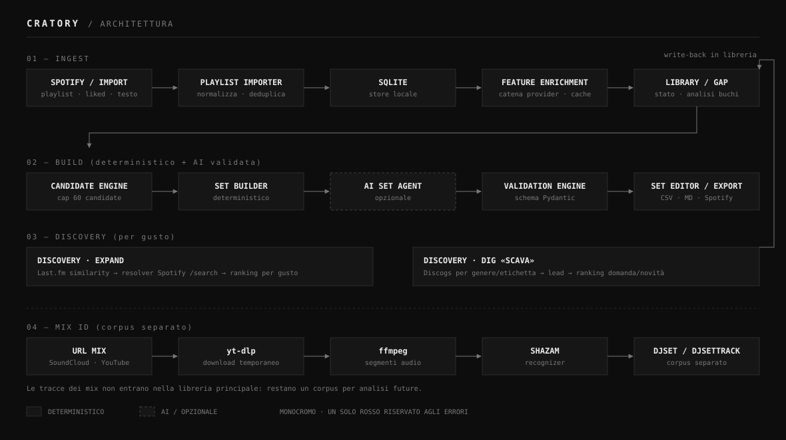

# Cratory

> A personal, self-hosted workbench that turns streaming playlists into thought-out DJ sets.
> (Formerly "DJ Assistant"; legacy technical names like `djassistant.db` are kept for local compatibility.)

Cratory is a personal, local/self-hosted, single-user web app for DJ set preparation. It
imports Spotify playlists (or pasted tracklists), normalizes and de-duplicates tracks,
indexes your on-disk library, imports BPM/Camelot key from a Rekordbox collection export,
derives track energy deterministically, analyzes library gaps, generates explained set
drafts, and helps you discover music that fits your taste. Text metadata enrichment
(title/artist/album/label/genre) and disk tagging are handled by the companion app
Sortory, not by Cratory.

It is **not a SaaS** — and that is a design choice, not a limitation. Spotify's Web API
forbids a public multi-tenant Spotify app (development mode caps at 5 users; extended
quota needs a launched organization with 250k+ monthly users), so Cratory leans the other
way on purpose: a single-user tool where the value is product quality, not scale. It never
plays audio. It never stores audio either, with one declared exception: optional, explicit
file acquisition via Soulseek (through a local [slskd](https://github.com/slskd/slskd)
daemon), linked to an existing library track. The Shazam module remains separate — it
downloads audio only temporarily to fingerprint external mixes, and persists only the
identified tracklist.

**Disk-first:** the library is the disk. Cratory indexes your canonical music
folder (`LIBRARY_ROOT`), re-links files by audio hash after Sortory
renames/moves them, and builds sets from tracks you actually own. Streaming
playlists are *leads* — candidates to acquire — not the library. The index
re-runs automatically on every app startup and scans incrementally; an optional
archive folder (`ARCHIVE_ROOT`) marks discarded tracks. Cratory only *reads* files
to index them — it never writes tags or moves anything on disk; that stays the job
of Sortory.

**BPM/key come from Rekordbox, not from providers.** Cratory never estimates or
invents mixing features: you analyze your library in Rekordbox and export the
collection (`File > Export Collection in xml format`); Cratory imports that XML to
fill in BPM and Camelot key on tracks you already own, without ever overwriting a
value that's already set. `energy` is always a deterministic value derived from
BPM + genre — it is not sourced from any provider and cannot be edited by hand.

## Features

- Import Spotify playlists, liked tracks, and pasted tracklists.
- De-duplicate by `ISRC → platform id → artist/title/duration → fuzzy match`.
- Import BPM and Camelot key from a Rekordbox collection XML export
  (`POST /api/rekordbox/import`), matching owned tracks by path, then audio hash,
  then artist/title — never overwriting an existing value.
- Manual corrections for BPM, Camelot key, genre and label (manual wins; `energy` is
  derived only and not directly editable).
- Generate sets with a deterministic engine plus optional, validated AI.
- Classify transitions as technically safe, creative risk, or good reset.
- Discovery by taste: crate-dig by genre/label via Discogs ("Scava") — the only
  external provider left for Discovery (plus the Spotify resolver), and it serves
  Discovery only, not track features.
- Identify mix tracklists via Shazam/yt-dlp/ffmpeg into a corpus kept separate from the
  library — the only audio fingerprinting Cratory does (of external mixes, not of your
  library).
- Acquire files for tracks you already own the rights to via Soulseek (slskd), with
  deterministic candidate ranking and per-playlist or per-track download, plus free
  search with manual pick and a persistent "to fix" queue (retry/ignore).
- Link a file already on disk to a track from the track detail (searches `LIBRARY_ROOT`
  and the slskd download folder).

## Architecture at a glance



A **deterministic engine** owns the facts: import, de-duplication, scoring, roles, gap
analysis, discovery ranking and validation. The **AI layer** owns language: prompt
interpretation, narrative direction and explanations. The AI never sees the whole
library — the Candidate Engine passes it at most 60 candidates — and every AI output is
validated against Pydantic schemas before it is shown or saved. BPM and key are never
invented: they come only from a Rekordbox import or explicit manual correction; `energy`
is always derived deterministically from BPM and genre.

Full picture in [docs/ARCHITECTURE.md](docs/ARCHITECTURE.md).

## Tech stack

```text
Backend:   Python, FastAPI, SQLAlchemy, Pydantic
Frontend:  Next.js 16, React, Tailwind / design system
Database:  SQLite (local); PostgreSQL in backlog
AI:        LLM behind an interface, outputs validated with Pydantic
External:  Spotify, Discogs (Discovery only), Shazam, slskd, Rekordbox (XML import)
```

## Quickstart

Prerequisites: Python 3.12+, Node.js 20+. The Shazam module also needs system `ffmpeg`
plus the `yt-dlp` and `shazamio` Python dependencies (in `backend/requirements.txt`). File
acquisition needs a separately running [slskd](https://github.com/slskd/slskd) instance
(not bundled). BPM/key import needs a Rekordbox collection exported as XML
(`File > Export Collection in xml format`) — no extra dependency, it's just a file upload.
Full dependency list in [docs/DEPENDENCIES.md](docs/DEPENDENCIES.md).

Backend:

```bash
cd backend
python -m venv .venv
source .venv/bin/activate      # Windows: .\.venv\Scripts\Activate.ps1
pip install -r requirements.txt
cp .env.example .env
uvicorn app.main:app --reload --port 8000
```

Frontend:

```bash
cd frontend
npm install
npm run dev
```

Local URLs: app at `http://localhost:3000`, API docs at `http://localhost:8000/docs`,
health at `http://localhost:8000/api/health`.

Shortcut: `./start-dev.sh` (macOS/Linux) or `start-dev.bat` (Windows) starts backend +
frontend, plus a local slskd (`:5030`) and the sibling Sortory app (`:8010`/`:3010`)
when available.

## Configuration

Variables live in `backend/.env` (start from `backend/.env.example`).

Minimum for Spotify import:

```text
SPOTIFY_CLIENT_ID=
SPOTIFY_CLIENT_SECRET=
SPOTIFY_REDIRECT_URI=http://127.0.0.1:8000/api/spotify/callback
```

Recommended providers (Discovery only — none of these feed BPM/key/genre):

```text
DISCOGS_TOKEN=
AI_API_KEY=
AI_MODEL=
AI_MODEL_CREATIVE=
```

File acquisition (optional):

```text
SLSKD_URL=
SLSKD_API_KEY=
SLSKD_DOWNLOAD_DIR=
```

Disk-first library indexing (optional):

```text
LIBRARY_ROOT=
ARCHIVE_ROOT=
ORGANIZER_URL=
```

Spotify provides track identity, editorial metadata, covers, duration, ISRC, URLs and
playlists — not reliable mixing BPM/key. `DISCOGS_TOKEN` is optional: Discovery "Scava"
works without it; the token only raises the rate limit. `SLSKD_URL`/`SLSKD_DOWNLOAD_DIR`
point to your own running slskd instance; without them, file acquisition stays disabled
and the rest of the app is unaffected. `LIBRARY_ROOT` points to your canonical, organized
music folder (the one Sortory manages); leave it empty to keep library indexing
disabled — Settings → "Library (disk)" triggers `POST /api/library/index` once it is
set (the index also re-runs automatically at every app startup, incremental scan),
matching files to tracks by audio hash (falling back to legacy digest, ISRC, then
fuzzy artist+title) and marking them as owned (`has_local_file`). `ARCHIVE_ROOT` is an
optional discarded-tracks folder (DJPlayer's PASSED bin) recognized alongside the
library. `ORGANIZER_URL` powers the optional "Open Sortory" link in the dashboard.

## Database

The canonical local database is `backend/data/djassistant.db` (the legacy name is kept on
purpose). Relative SQLite paths in `DATABASE_URL` resolve against `backend/`, so the app
doesn't create stray databases per working directory. To wipe user data:

```bash
cd backend
python -m app.tools.clean_user_data library --include-backups
```

The `library` mode clears playlists, tracks and sets while preserving Spotify tokens;
`all` also removes tokens unless `--preserve-tokens` is passed.

## Workflow

The dashboard opens with a five-stage pipeline strip — **Discover → Acquire →
Organize⤴ → Analyze⤴ → Play** — that shows where you are and what's next.
Organize and Analyze hand off to the companion apps (Sortory for tagging, Rekordbox
for BPM/key analysis) and loop back with an import. Indexing the library (scanning
`LIBRARY_ROOT`) runs from the "Index" button in the left nav (or automatically at
startup), so it isn't a strip stage.

Typical run: start backend + frontend → in Settings, connect Spotify → import a playlist
or paste a tracklist → run Sortory separately to tag and organize new files onto disk
→ index the library (Settings → "Library (disk)", or let it auto-run at startup) →
analyze new tracks in Rekordbox and import the collection XML to fill in BPM/key →
generate a set (technical or creative) → review transitions, warnings and alternatives →
export or create a Spotify playlist → use Discovery ("Scava" by genre/label via
Discogs) to find tracks that fit your taste → optionally acquire files for tracks you own
via Soulseek (Downloads page, per-playlist or per-track from Discovery), once slskd is
running and configured.

**A note on responsible use.** Cratory is a personal, self-hosted tool, not a public
service. The optional Soulseek acquisition feature is a thin client over your own slskd
instance — it does not host, share, or redistribute anything. What you search for and
download, and whether you have the right to acquire it, is entirely your responsibility.

## Tests

```bash
cd backend && python -m pytest tests
cd frontend && npm run lint && npm run build
```

## Documentation

| Document | Purpose |
|---|---|
| [docs/ARCHITECTURE.md](docs/ARCHITECTURE.md) | Principles, pipeline, backend layers, data model, integrations |
| [docs/API.md](docs/API.md) | Current FastAPI REST contracts |
| [docs/ROADMAP.md](docs/ROADMAP.md) | Status, naming, backlog, next steps — the source of truth for project state |
| [docs/DESIGN.md](docs/DESIGN.md) | Product context + design system ("editorial archive") |
| [docs/DEPENDENCIES.md](docs/DEPENDENCIES.md) | All runtime/build dependencies and external services |
| [PROGRESS.md](PROGRESS.md) | Chronological work diary |
| [CLAUDE.md](CLAUDE.md) | Guide for the AI collaborator |

## Status

Core is settled; documentation has been reworked; the next open front is Discovery quality.
See [docs/ROADMAP.md](docs/ROADMAP.md) for the current state and backlog.
